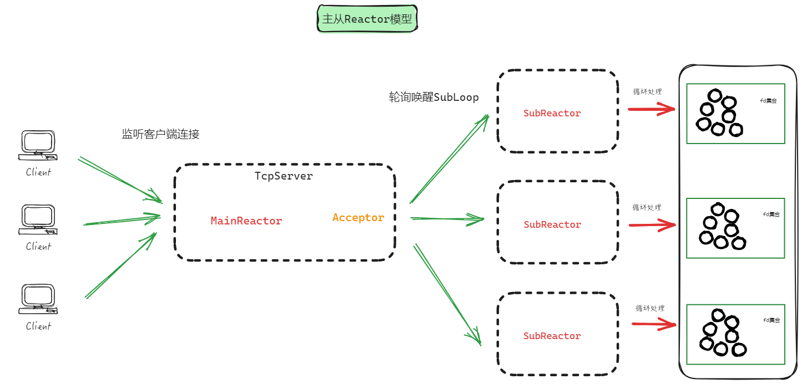

# 万丈高楼平地起

```c++
#include <stdio.h>
#include <unistd.h>
#include <stdlib.h>
#include <string.h>
#include <errno.h>
#include <sys/socket.h>
#include <sys/types.h>
#include <arpa/inet.h>
#include <sys/fcntl.h>
#include <sys/epoll.h>
#include <netinet/tcp.h>

// 设置非阻塞的IO。
void setnonblocking(int fd) {
    fcntl(fd, F_SETFL, fcntl(fd, F_GETFL) | O_NONBLOCK);
}

int main(int argc, char *argv[]) {
    if (argc != 3) {
        printf("用法: ./tcpepoll IP 地址 端口\n");
        printf("示例: ./tcpepoll 192.168.150.128 5085\n\n");
        return -1;
    }

    // 创建服务端用于监听的listenfd。
    int listenfd = socket(AF_INET, SOCK_STREAM, IPPROTO_TCP);
    if (listenfd < 0) {
        perror("socket() 失败");
        return -1;
    }

    int opt = 1;
    // 设置socket选项
    setsockopt(listenfd, SOL_SOCKET, SO_REUSEADDR, &opt, sizeof(opt));
    setsockopt(listenfd, SOL_SOCKET, TCP_NODELAY, &opt, sizeof(opt));
    setsockopt(listenfd, SOL_SOCKET, SO_REUSEPORT, &opt, sizeof(opt));
    setsockopt(listenfd, SOL_SOCKET, SO_KEEPALIVE, &opt, sizeof(opt));

    setnonblocking(listenfd);

    struct sockaddr_in servaddr;
    servaddr.sin_family = AF_INET;
    servaddr.sin_addr.s_addr = inet_addr(argv[1]);
    servaddr.sin_port = htons(atoi(argv[2]));

    if (bind(listenfd, (struct sockaddr *)&servaddr, sizeof(servaddr)) < 0) {
        perror("bind() 失败");
        close(listenfd);
        return -1;
    }

    if (listen(listenfd, 128) != 0) {
        perror("listen() 失败");
        close(listenfd);
        return -1;
    }

    int epollfd = epoll_create(1);

    struct epoll_event ev;
    ev.data.fd = listenfd;
    ev.events = EPOLLIN;

    epoll_ctl(epollfd, EPOLL_CTL_ADD, listenfd, &ev);

    struct epoll_event evs[10];

    while (1) {
        int infds = epoll_wait(epollfd, evs, 10, -1);

        if (infds < 0) {
            perror("epoll_wait() 失败");
            break;
        }

        if (infds == 0) {
            printf("epoll_wait() 超时.\n");
            continue;
        }

        for (int ii = 0; ii < infds; ii++) {
            if (evs[ii].data.fd == listenfd) {
                struct sockaddr_in clientaddr;
                socklen_t len = sizeof(clientaddr);
                int clientfd = accept(listenfd, (struct sockaddr *)&clientaddr, &len);
                setnonblocking(clientfd);

                printf("接受客户端连接(fd=%d,ip=%s,port=%d) 成功.\n", clientfd, inet_ntoa(clientaddr.sin_addr), ntohs(clientaddr.sin_port));

                ev.data.fd = clientfd;
                ev.events = EPOLLIN | EPOLLET;
                epoll_ctl(epollfd, EPOLL_CTL_ADD, clientfd, &ev);
            } else {
                if (evs[ii].events & EPOLLRDHUP) {
                    printf("1客户端(eventfd=%d) 断开连接.\n", evs[ii].data.fd);
                    close(evs[ii].data.fd);
                } else if (evs[ii].events & (EPOLLIN | EPOLLPRI)) {
                    char buffer[1024];
                    while (1) {
                        bzero(&buffer, sizeof(buffer));
                        ssize_t nread = read(evs[ii].data.fd, buffer, sizeof(buffer));
                        if (nread > 0) {
                            printf("接收(eventfd=%d):%s\n", evs[ii].data.fd, buffer);
                            send(evs[ii].data.fd, buffer, strlen(buffer), 0);
                        } else if (nread == -1 && errno == EINTR) {
                            continue;
                        } else if (nread == -1 && ((errno == EAGAIN) || (errno == EWOULDBLOCK))) {
                            break;
                        } else if (nread == 0) {
                            printf("2客户端(eventfd=%d) 断开连接.\n", evs[ii].data.fd);
                            close(evs[ii].data.fd);
                            break;
                        }
                    }
                } else if (evs[ii].events & EPOLLOUT) {
                    // 处理输出事件
                } else {
                    printf("3客户端(eventfd=%d) 发生错误.\n", evs[ii].data.fd);
                    close(evs[ii].data.fd);
                }
            }
        }
    }

    return 0;
}
```

# 只不过披上一张皮

## InetAddress

```c++
struct sockaddr_in Addr_;
```

只有一个成员变量，因此当你需要这样类型的变量的时候，即用此类

考虑到不管是客户端还是服务端的地址和端口的显示经常用到，也提供对应的接口

## Socket

核心是对bind、listen、accept方法的封装

而createNonblocking方法即是对socket方法的封装，调用此方法就会得到非阻塞的socked

回顾前面简单的服务器设计知道，这只需要存在一个即可，等到后面调用listen方法之后就能够监听客户端连接了

## Epoller

对epoll的三大方法的封装

```c++
  void updateChannel(Channel *ch);  // 封装 EPOLL_CTL_MOD EPOLL_CTL_ADD
  void removeChannel(Channel *ch);  // 封装 EPOLL_CTL_DEL

  std::vector<Channel*> loop(int timeout = -1); // 封装 epoll_wait 监听fd上发生的事件 并返回
```

至于epoll_create方法是在构造函数中完成

```c++
Epoller::Epoller() {
  epollfd_ = epoll_create(1);
  if (epollfd_ == -1) {
    perror("epoll_create failed \n");
    exit(-1);
  }
}
```

## Timestamp

可以通过它获取一个时间戳，如果用户不传递时间数的话就默认获取当前时间

支持两种显示，一种是把时间转换为一串数字，一种是把时间转换为人类易读的字符串

## Buffer

缓冲区的设计是为了解决粘包和粘包问题，这里采用的解决方案是：传递数据的长度+传递的数据

这样可以通过截取传递数据的长度 读取用户发送的消息长度，避免粘包和粘包问题

# 生生世世永不分

## Channel

一个 Channel 对应 一个 fd，而fd在网络通信中分为 listenfd（对应Acceptor类）（存在一个） 和 connfd（对应Connection类）（存在多个）

而管理 Channel 的是 EventLoop对象

连接事件回调的设置、连接感兴趣事件的注册和移除、连接事件回调的执行皆在此类中完成

## Acceptor

前面我们只是讲 Socket 类封装 bind 和 listen 方法，可是并没有被实际调用，这个任务将会由 Acceptor 构造函数来完成，只要你创建 Acceptor 对象即可

因此，我们讲 Accetpor对象 就类视于 listenfd ，时刻监听 客户端的连接的到来

```c++
Acceptor::Acceptor(EventLoop *loop,const std::string &ip, const uint16_t port)
  : loop_(loop)
  , servSock_(createNonblocking())
  , acceptChannel_(loop_,servSock_.getfd())
{
  InetAddress servaddr(ip,port);             // 服务端的地址和协议。
  servSock_.setreuseaddr(true);
  servSock_.settcpnodelay(true);
  servSock_.setreuseport(true);
  servSock_.setkeepalive(true);
  servSock_.bind(servaddr);
  servSock_.listen();

  //从此刻开始 Acceptor的工作就是 ： 持续监听新来的连接 并为该连接相应的回调函数，且把对应的读事件注册到epoll树上

  acceptChannel_.setreadCallback(std::bind(&Acceptor::newConnection, this));    //简单一句话 绑定回调函数newConnection
  acceptChannel_.enableReading(); //把 acceptChannel_ 交给 epoll监视 其读事件
}
```

我们说 Acceptor 就是对 Channel 的封装，创建 Accetpor 对象时，构造函数中就会创建一个 acceptChannel_

通过为 acceptChannel_ 设置读事件的回调并注册到 epoll 树上，只要客户端有建立连接请求（即读事件）就会触发设置的读事件回调，即 newConnection

```c++
void Acceptor::newConnection() {
  InetAddress clientAddr;
  std::unique_ptr<Socket> clientSock(new Socket(servSock_.accept(clientAddr)));
  clientSock->setIpPort(clientAddr.getIP(),clientAddr.getPort());

  NewConnCb_(std::move(clientSock));
}
void Acceptor::setNewConnCb(Acceptor::NewConnCb cb) {
  NewConnCb_ = cb;
}
```

这里的实际回调函数是NewConnCb_，实际上由 TcpServer 类 设置的，该回调函数（TcpServer 类中实现的）实际的功能是：

- 创建一个 Connection 对象（代表 connfd ）
- 并为这个连接设置事件回调
- 然后交由任意一个 subLoop 进行管理
- 同时执行用户自定义的回调函数 newconnectioncb_

```c++
void TcpServer::newconnection(std::unique_ptr<Socket> clientsock) {
  // 创建一个新的连接对象
  spConnection conn(new Connection(subloops_[clientsock->getfd() % threadNum_].get(),std::move(clientsock)));

  // 设置连接对象的关闭、错误、消息接收以及写入完成等回调函数
  conn->setCloseCallback(std::bind(&TcpServer::closeconnection,this,std::placeholders::_1));
  conn->setErrorCallback(std::bind(&TcpServer::errorconnection,this,std::placeholders::_1));
  conn->setOnmessageCallback(std::bind(&TcpServer::onmessage,this,std::placeholders::_1,std::placeholders::_2));
  conn->setWriteCallback(std::bind(&TcpServer::sendcomplete,this,std::placeholders::_1));

  {
    // 使用互斥锁保护临界区，将连接对象添加到连接管理器中
    std::lock_guard<std::mutex> lock_guard(connmutex_);
    conns_[conn->getCfd()] = conn;
  }

  // 将连接对象交给子事件循环处理
  subloops_[conn->getCfd() % threadNum_]->newconnection(conn);

  // 如果设置了新连接回调函数，调用该回调函数通知外部有新连接建立
  if (newconnectioncb_){
    newconnectioncb_(conn);
  }
}
```

我们追究的太深，从创建Accetpor 就牵扯到这里

至少，我们现在知道 Acceptor <span style="color:red">监听新连接</span>，只要有客户端建立连接就会触发回调并创建Connection对象来代表客户端和服务端的连接，<span style="color:red">将连接分发给SubLoop（从多个SubLoop中选取一个）进行管理</span>，最后还会执行用户设置的回调函数（如果用户设置的话）

## EventLoop

EventLoop分为：MainLoop 和 SubLoop

连接建立之前的工作由 MainLoop 完成，连接建立之后的工作由 SubLoop 完成

```c++
void EventLoop::run() {
  threadId_ = syscall(SYS_gettid);  // 获取事件循环所在线程的id

  while (!stop_){
    std::vector<Channel *> channels = ep_->loop(10 * 1000);		// 底层调用epoll_wait

    if (channels.empty()){  //没有事件发生
      epollTimeoutCallback_(this);
    }else{
      for (auto &ch : channels) {
        ch->handleEvent();    //执行事件绑定的回调
      }
    }
  }
}
```

这是EventLoop最核心的功能，即底层调用epoll_wait，把发生的事件执行对应的回调函数

## Connection

一个 Connection 对象 就是 客户端和服务端建立的连接

一个连接的事件无外乎四种：读事件、写事件、连接错误事件、连接关闭事件

这里已经绑定相应的回调，Connection 类中已经实现。但又不能说完全实现了，因为每个事件回调函数里面又有一个回调函数的执行，即由用户传递的（读事件、写事件、连接错误事件、连接关闭事件）回调函数（用户传递给TcpServer即可，TcpServer会设置的）

这样就实现业务层和网络层的分离，用户可以根据自己的需求设置事件回调函数

```c++
//处理对端发来的消息
void Connection::onmessageCallback() {
  char buffer[1024];

  while (true) { // 由于使用非阻塞IO，一次读取buffer大小数据，直到全部的数据读取完毕
    bzero(&buffer, sizeof(buffer));

    ssize_t nread = read(getCfd(), buffer, sizeof(buffer));    //读取客户端发送的数据

    if (nread > 0) { //成功读取到数据
      inputBuffer_->append(buffer, nread);
    } else if (nread == -1 && errno == EINTR) { // 读取数据的时候被信号中断，继续读取
      continue;
    } else if (nread == -1 && ((errno == EAGAIN) || (errno == EWOULDBLOCK))) {  // 全部的数据已读取完毕
      std::string message;
      while (true) { // 从接收缓冲区中拆分出客户端的请求消息
        if (!inputBuffer_->pickMessage(message)) break;
        lastTime_ = Timestamp::now();

        onmessagecallback_(shared_from_this(), message);
      }
      break;
    } else if (nread == 0) { //客户端断开连接
      closeCallback();
      break;
    }
  }
}
void Connection::closeCallback() {
  disConnect_ = true;
  clientChannel_->remove();
  closecallback_(shared_from_this());
}
void Connection::errorCallback() {
  disConnect_ = true;
  clientChannel_->remove();
  errorcallback_(shared_from_this());
}

// 处理写事件的回调函数
void Connection::writeCallback() {
  int writen = ::send(getCfd(),outputBuffer_->data(),outputBuffer_->size(),0);
  if (writen < 0){
    outputBuffer_->erase(0,writen);
  }
  if (outputBuffer_->size() == 0){  //缓冲区中没有数据了
    clientChannel_->disableWriting();
    sendcompletecallback_(shared_from_this());
  }
}
```

## ThreadPool

启动SubLoop，只不过创建SubLoop是由TcpServer完成的

## TcpServer

TcpServer类是给用户使用的，尽管这个类还可以再进行一层封装，让用户能够更方便的使用整个网络库

创建TcpServer类并执行start方法

```c++
TcpServer::TcpServer(const std::string &ip, const uint16_t port, int threadnum)
  : threadNum_(threadnum)
  , mainloop_(new EventLoop(true))
  , acceptor_(mainloop_.get(),ip,port)
  , threadpool_(threadNum_,"IO")
{
  mainloop_->setEpollTimeoutCallback(std::bind(&TcpServer::epolltimeout, this,std::placeholders::_1));

  acceptor_.setNewConnCb(std::bind(&TcpServer::newconnection, this,std::placeholders::_1));

  for (int i = 0; i < threadNum_; i++) {
    subloops_.emplace_back(new EventLoop(false,5,10));
    subloops_[i]->setEpollTimeoutCallback(std::bind(&TcpServer::epolltimeout, this,std::placeholders::_1));
    subloops_[i]->setTimerCallback(std::bind(&TcpServer::removeconn, this,std::placeholders::_1));
    threadpool_.addtask(std::bind(&EventLoop::run,subloops_[i].get())); //绑定subLoop，因为任务的处理由subloops_完成
  }
}

void TcpServer::start() {
  mainloop_->run();
}
```

MainLoop和SubLoop启动（处理客户端连接上发生的事件）起来了，Acceptor也是被TcpServer创建（开始监听客户端连接）

## 
